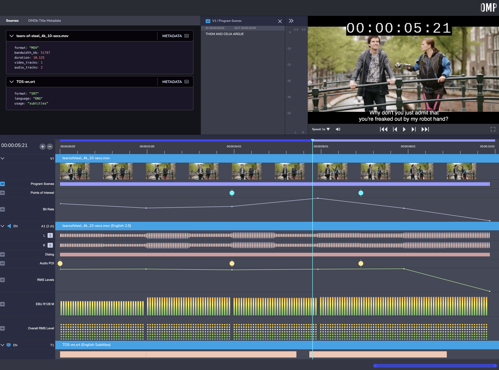

# Omakase Reference Player

The Omakase Reference Player is an application focused on a QC usecase that showcases the main capabilities of the [Omakase Player](https://player.byomakase.org/).

# Development server

1. Execute the following commands to install dependencies and start development server:

```bash
npm install
ng serve --port 3000
```

2. Navigate to [http://localhost:3000/?session=http://localhost:3000/demo-assets/tears-of-steel/v2_10-SEC/tears-of-steel_24fps_10-SEC.json](http://localhost:3000/?session=http://localhost:3000/demo-assets/tears-of-steel/v2_10-SEC/tears-of-steel_24fps_10-SEC.json)
   to open the application in development mode with the default demo session file.



The application will automatically reload if you change any of the source files.

In development mode, the `/demo-assets` directory is served in development server root and `http://localhost:3000/demo-assets/` is the root location for demo files.

# Configuration guide

Application requires a JSON configuration file to be passed as a `session` query parameter in the URL.

The configuration file describes the media that is presented in the player as well as the layout of the timeline (see the default demo example).

The JSON configuration file must correspond to structure defined in `src/model/domain.model.ts`:

```ts
export interface SessionData {
  authentication?: AuthenticationData;
  data: {
    source_info: SourceInfo[];
    media_info: MediaInfo[];
    master_manifests: MasterManifest[];
    media_tracks: MediaTracks;
    presentation: Presentation;
  };
}
```

## Build

Run `ng build --configuration=dev --localize=false --base-href=/` to build the project. The build artifacts will be stored in the `dist/` directory.

## Links

- Omakase Player Web: [https://player.byomakase.org/](https://player.byomakase.org/)
- Omakase Player GitHub: [https://github.com/byomakase/omakase-player](https://github.com/byomakase/omakase-player)
- Omakase Media Tools GitHub: [https://github.com/byomakase/omakase-media-tools](https://github.com/byomakase/omakase-media-tools)

## Further help

CORS must be taken into account if configuration file is served from different domain than server running the Omakase Reference Player


